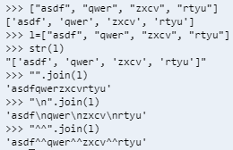
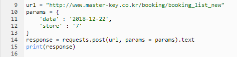

## 2018 12 21

> ##### 복습
>
> ##### Telegram
>
> ```python
> @app.route(토큰)
> def telegram():
>     
> ```
>
> ##### WebHook
>
> ```python
> @app.route('/setwebhook')
> def setwebhook():
>     
> ```
>
> - webhook을 받을 url을 등록 ('/token')
> - 언제 올지 모르는 메시지를 계속 확인하는 것이 아닌 받을 때마다 알아서 업데이트함 (ex. 인터럽트)
> - 등록해놓은 url로 메시지를 받을 수 있음!
> - Send Msg , 200(응답코드)
> - TELEGRAM_TOKEN을 문자열로 할 경우 다른사람이 쉽게 들어올 수 있고 변조될 가능성 높아짐
> - 여러개의 배열이 있을 때 문자열 하나로 만들어 주는 것이 있음!
>
>
>
> 
>
> - **requests**는 요청을 하는 아이 (get을 쓰는 것은 요청을 보낸다는 의미)
> - **request**는 텔레그램의 url로 들어온 요청!
>
> *app.py*
>
> ```python
> from flask import Flask, request
> import requests
> import json
> import time
> import os
> from bs4 import BeautifulSoup as bs
> 
> app = Flask(__name__)
> 
> 
> ### TELEGRAM_TOKEN을 문자열로 할 경우 다른사람이 쉽게 들어올 수 있고 변조될 가능성 높아짐
> TELEGRAM_TOKEN = os.getenv('TELEGRAM_TOKEN')
> #우회서버 이용할거야
> TELEGRAM_URL = 'https://api.hphk.io/telegram'
> 
> @app.route('/{}'.format(TELEGRAM_TOKEN), methods=['POST'])
> def telegram():
>     # 텔레그램으로부터 요청이 들어올 경우, 해당 요청을 처리하는 코드
>     req = request.get_json()
>     chat_id = req["message"]["from"]["id"]
>     msg = req["message"]["text"]
>     ex_url = 'http://m.exchange.daum.net/mobile/exchange/exchangeMain.daum'
>     ex_response = requests.get(ex_url).text
>     soup = bs(ex_response, 'html.parser')
>     
>     li = soup.select('.name')
>     
>     lists = []
>     count = 0
>     for i in li:
>         list = {
>             "country" : i.select_one('a').text,
>             
>             "exch" : soup.select('.idx')[count].text
>         }
>         lists.append(list)
>         count+=1
>     
>     if(msg == "환율"):
>         msg = ""
>         for i in lists:
>             msg += '\n' + i["country"]+'\t\t'+i["exch"]
>     
>     print(msg)
>     url = 'https://api.hphk.io/telegram/bot{}/sendMessage'.format(TELEGRAM_TOKEN)
>     requests.get(url, params = {"chat_id": chat_id, "text": msg})
>     return '', 200
> 
> # webhook을 등록해야함!
> # webhook : alert 주는 것!
> # 업데이트 되었는지 계속해서 확인하는 것이 아니라 webhook을 통해서 자동으로 업데이트 확인
> 
> @app.route('/set_webhook')
> def set_webhook():
>     url = TELEGRAM_URL + '/bot' + TELEGRAM_TOKEN + '/setWebhook'
>     params = {
>         # url은 우리가 만든 홈페이지에서 ':8080' 빼고 나머지 / http뒤에 s 붙여야함
>         'url' : 'https://ssafy-week2-jeonghwa1017.c9users.io/{}'.format(TELEGRAM_TOKEN)
>     }
>     
>     response = requests.get(url, params = params)
>     return response
>     
> 
> 
> ```
>
>

#### 마스터 키

###### 매장 정리

1. 홈페이지에서 목록을 가져올 부분 찾기
   1. '페이지 소스 보기'로 어떤 부분을 가져올 지 확인
   2. 'Network' 탭으로 가서 같은 부분을 찾기
   3. Request URL 찾아서 소스에 넣기
2. 해당 주소에서 필요한 부분 검색해서 목록 뽑기!

*master_key.py*

```python
from bs4 import BeautifulSoup as bs
import requests

## 여기서는 requests.post로!! Network 탭의 Request Method 방식
## get 방식은 url에 파라미터 정보가 있지만
## post 방식은 숨어있음. 맨 밑에 Form Data라는 곳에 정보 있음
## params 변수에 위의 데이터 정보 넘겨주기

def master_key_info(cd):
    url = "http://www.master-key.co.kr/booking/booking_list_new"
    params = {
        'data' : '2018-12-22',
        'store' : cd
    }
    response = requests.post(url, params).text
    document = bs(response, 'html.parser')
    ul = document.select(".reserve .escape_view")
    
    for li in ul:
        title = li.select('p')[0].text
        info=''
        print(title)
        for col in li.select('.col'):
            info = info + '{} , {}\n' .format(col.select_one('.time').text, col.select_one('.state').text)
        print(info)
        


def master_key_list():
    url = "http://www.master-key.co.kr/home/office"
    
    response = requests.get(url).text
    
    document = bs(response, 'html.parser')
    
    lis = document.select(".escape_list .escape_view")
    
    ### a python how to eliminate string from string?
    cafe_list = []
    for li in lis:
        title = li.select_one(' p ').text
        if(title.endswith('NEW')):
            # 맨 뒤에 세 글자 잘라라!
            title = title[:-3]
        address = "http://www.master-key.co.kr" + li.select_one('dd').text
        tel = li.select('dd')[1].text
        link = li.select_one('a')["href"]
        
        cafe = {
            "title" : title,
            "address" : address,
            "tel" : tel,
            "link" : link
        }
        cafe_list.append(cafe)
    return cafe_list
    
# 사용자로부터 '마스터키 ****점'이라는 메시지를 받으면

# msg.split(' ')[1] <= 지점명 냐????????

# 해당 지점에 대한 오늘의 정보를 요청하고(크롤링)

# 메시지(예약정보)를 보내준다
    
for cafe in master_key_list():
    print('{} : {}'.format(cafe["title"], cafe["link"].split('=')[0]))
(master_key_info(7))
```

###### 예약한 방 검색

1. 지점 하나 들어가서 예약 홈페이지 접속해서 url 가져오기
   1. Network 탭으로 가서 날짜 바꿨을 때 달라지는 부분 찾아서 예약할 수 있는 코드 찾기
   2. Request URL 복사해서 가져오기
      - Request Method부분을 보면 이전과 다르게 POS
      - 
      - T 방식.
      - URL 방식의 경우 파라미터 값(ex. 예약 날짜)이 URL 내에 ? 이후 나타나지만
      - POST방식의 경우 Headers 맨 아래 부분의 **Form Data** 부분에 나타남
      - **Form Data** 파라미터의 내용을 params 내에 저장해서 requests에 넘겨주어야함




```python
for li in ul:
    title = li.select('p')[0].text
    info = ''
    for col in li.select('.col'):
        info = info + '{}+{}\n' .format(col.select_one(.time).text, col.select_one(.state).text)
```

위에꺼 다시 이해해야함


*app.py*

```python
from flask import Flask, request
import requests
import json
import time
import os
from bs4 import BeautifulSoup as bs

app = Flask(__name__)


### TELEGRAM_TOKEN을 문자열로 할 경우 다른사람이 쉽게 들어올 수 있고 변조될 가능성 높아짐
TELEGRAM_TOKEN = os.getenv('TELEGRAM_TOKEN')
#우회서버 이용할거야
TELEGRAM_URL = 'https://api.hphk.io/telegram'

cafe_keys = {
    '전체' : -1,
    '부천점' : 15,
    '안양점' : 13,
    '대구동성로2호점' : 14,
    '대구동성로점' : 9,
    '궁동직영점' : 1,
    '은행직영점' : 2,
    '부산서면점' : 19,
    '홍대상수점' : 20,
    '강남점' : 16,
    '건대점' : 10,
    '홍대점' : 11,
    '신촌점' : 6,
    '잠실점' : 21,
    '부평점' : 17,
    '익산점' : 12,
    '전주고사점' : 8,
    '천안신부점' : 18,
    '천안점' : 3,
    '천안두정점' : 7,
    '청주점' : 4
    }

def master_key_info(cd):
    url = "http://www.master-key.co.kr/booking/booking_list_new"
    params = {
        'data' : time.strftime("%Y-%m-%d"),
        'store' : cd,
        'room' : ''
    }
    
    response = requests.post(url, params).text
    document = bs(response, 'html.parser')
    ul = document.select(".reserve .escape_view")
    
    theme_list = []
    for li in ul:
        title = li.select('p')[0].text
        info=''
        print(title)
        for col in li.select('.col'):
            info = info + '{} , {}\n' .format(col.select_one('.time').text, col.select_one('.state').text)
        theme={
            'title' : title,
            'info' : info
        }
        theme_list.append(theme)
        
    return theme_list


def master_key_list():
    url = "http://www.master-key.co.kr/home/office"
    
    response = requests.get(url).text
    
    document = bs(response, 'html.parser')
    
    lis = document.select(".escape_list .escape_view")
    
    
    ### a python how to eliminate string from string?
    cafe_list = []
    for li in lis:
        title = li.select_one(' p ').text
        if(title.endswith('NEW')):
            # 맨 뒤에 세 글자 잘라라!
            title = title[:-3]
        address = li.select_one('dd').text
        tel = li.select('dd')[1].text
        link = "http://www.master-key.co.kr" + li.select_one('a')["href"]
        
        cafe = {
            "title" : title,
            "address" : address,
            "tel" : tel,
            "link" : link
        }
        cafe_list.append(cafe)
    return cafe_list
    
    
@app.route('/{}'.format(TELEGRAM_TOKEN), methods=['POST'])
def telegram():
    # 텔레그램으로부터 요청이 들어올 경우, 해당 요청을 처리하는 코드
    req = request.get_json()
    chat_id = req["message"]["from"]["id"]
    msg = req["message"]["text"]
    
    # 마스터키 전체
    # 마스터키 ****점
    if (msg.startswith('마스터키')):
        cafe_name = msg.split(' ')[1]
        cd = cafe_keys[cafe_name]
        
        if(cd > 0):
            data = master_key_info(cd)
        else:
            data = master_key_list()
        msg = []
        for d in data:
            msg.append('\n'.join(d.values()))
        msg = '\n'.join(msg)
    else:
        msg = '등록되지 않은 지점입니다.'
    
    
    
    
    url = 'https://api.hphk.io/telegram/bot{}/sendMessage'.format(TELEGRAM_TOKEN)
    requests.get(url, params = {"chat_id": chat_id, "text": msg})
    return '', 200

# webhook을 등록해야함!
# webhook : alert 주는 것!
# 업데이트 되었는지 계속해서 확인하는 것이 아니라 webhook을 통해서 자동으로 업데이트 확인

@app.route('/set_webhook')
def set_webhook():
    url = TELEGRAM_URL + '/bot' + TELEGRAM_TOKEN + '/setWebhook'
    params = {
        # url은 우리가 만든 홈페이지에서 ':8080' 빼고 나머지 / http뒤에 s 붙여야함
        'url' : 'https://ssafy-week2-jeonghwa1017.c9users.io/{}'.format(TELEGRAM_TOKEN)
    }
    
    response = requests.get(url, params = params)
    return response
```


*seoul_escape_room.py*

```python
import requests
import json
import time
from bs4 import BeautifulSoup as bs

def get_total_info():
    url = "http://www.seoul-escape.com/reservation/change_date/"
    params = {
        'current_date': '2018/12/21'
    }
    response = requests.get(url, params = params).text
    
    document = json.loads(response)
    
    cafe_code = {
        '강남1호점':3,
        '홍대1호점':1,
        '부산 서면점':5,
        '인천 부평점':4,
        '강남2호점':11,
        '홍대2호점':10
    }
    total={}
    game_room_list = document["gameRoomList"]
    # 기본 틀 잡기
    for cafe in cafe_code:
        total[cafe]=[]
        for room in game_room_list:
            if(cafe_code[cafe]==room["branch_id"]):
                total[cafe].append({"title":room["room_name"], "info":[]})
        
    # 앞에서 만든 틀에 데이터 집어넣기
    book_list = document['bookList']    
    for cafe in total:
        for book in book_list:
            if(cafe==book["branch"]):
                for theme in total[cafe]:
                    if(theme["title"] == book['room']):
                        if(book["booked"]):
                            booked = "예약완료"
                        else:
                            booked = "예약가능"
                        theme['info'].append("{} - {}".format(book["hour"], booked))
                
    return total
    
def seoul_escape_list():
    total = get_total_info()
    return total.keys()
    
def seoul_escape_info(cd):
    total = get_total_info()
    cafe = total[cd]
    tmp = []
    for theme in cafe:
        tmp.append("{}\n {}".format(theme["title"],'\n'.join(theme["info"])))
    return tmp
    
# print('\n'.join(seoul_escape_info(5)))
```


*app.py*

```python
from flask import Flask, request
import requests
import json
import time
import os
from bs4 import BeautifulSoup as bs

app = Flask(__name__)


### TELEGRAM_TOKEN을 문자열로 할 경우 다른사람이 쉽게 들어올 수 있고 변조될 가능성 높아짐
TELEGRAM_TOKEN = os.getenv('TELEGRAM_TOKEN')
#우회서버 이용할거야
TELEGRAM_URL = 'https://api.hphk.io/telegram'

cafe_keys = {
    '전체' : -1,
    '부천점' : 15,
    '안양점' : 13,
    '대구동성로2호점' : 14,
    '대구동성로점' : 9,
    '궁동직영점' : 1,
    '은행직영점' : 2,
    '부산서면점' : 19,
    '홍대상수점' : 20,
    '강남점' : 16,
    '건대점' : 10,
    '홍대점' : 11,
    '신촌점' : 6,
    '잠실점' : 21,
    '부평점' : 17,
    '익산점' : 12,
    '전주고사점' : 8,
    '천안신부점' : 18,
    '천안점' : 3,
    '천안두정점' : 7,
    '청주점' : 4
    }
    
cafe_code = {
        '강남1호점':3,
        '홍대1호점':1,
        '부산 서면점':5,
        '인천 부평점':4,
        '강남2호점':11,
        '홍대2호점':10
    }

def get_total_info():
    url = "http://www.seoul-escape.com/reservation/change_date/"
    params = {
        'current_date': '2018/12/21'
    }
    response = requests.get(url, params = params).text
    
    document = json.loads(response)
    

    total={}
    game_room_list = document["gameRoomList"]
    # 기본 틀 잡기
    for cafe in cafe_code:
        total[cafe]=[]
        for room in game_room_list:
            if(cafe_code[cafe]==room["branch_id"]):
                total[cafe].append({"title":room["room_name"], "info":[]})
        
    # 앞에서 만든 틀에 데이터 집어넣기
    book_list = document['bookList']    
    for cafe in total:
        for book in book_list:
            if(cafe==book["branch"]):
                for theme in total[cafe]:
                    if(theme["title"] == book['room']):
                        if(book["booked"]):
                            booked = "예약완료"
                        else:
                            booked = "예약가능"
                        theme['info'].append("{} - {}".format(book["hour"], booked))
                
    return total
    
def seoul_escape_list():
    total = get_total_info()
    return total.keys()
    
def seoul_escape_info(cd):
    total = get_total_info()
    cafe = total[cd]
    tmp = []
    for theme in cafe:
        tmp.append("{}\n{}".format(theme["title"],'\n'.join(theme["info"])))
    return tmp
    
    
def master_key_info(cd):
    url = "http://www.master-key.co.kr/booking/booking_list_new"
    params = {
        'data' : time.strftime("%Y-%m-%d"),
        'store' : cd,
        'room' : ''
    }
    
    response = requests.post(url, params).text
    document = bs(response, 'html.parser')
    ul = document.select(".reserve .escape_view")
    
    theme_list = []
    for li in ul:
        title = li.select('p')[0].text
        info=''
        print(title)
        for col in li.select('.col'):
            info = info + '{} , {}\n' .format(col.select_one('.time').text, col.select_one('.state').text)
        theme={
            'title' : title,
            'info' : info
        }
        theme_list.append(theme)
        
    return theme_list


def master_key_list():
    url = "http://www.master-key.co.kr/home/office"
    
    response = requests.get(url).text
    
    document = bs(response, 'html.parser')
    
    lis = document.select(".escape_list .escape_view")
    
    
    ### a python how to eliminate string from string?
    cafe_list = []
    for li in lis:
        title = li.select_one(' p ').text
        if(title.endswith('NEW')):
            # 맨 뒤에 세 글자 잘라라!
            title = title[:-3]
        address = li.select_one('dd').text
        tel = li.select('dd')[1].text
        link = "http://www.master-key.co.kr" + li.select_one('a')["href"]
        
        cafe = {
            "title" : title,
            "address" : address,
            "tel" : tel,
            "link" : link
        }
        cafe_list.append(cafe)
    return cafe_list
    
    
@app.route('/{}'.format(TELEGRAM_TOKEN), methods=['POST'])
def telegram():
    # 텔레그램으로부터 요청이 들어올 경우, 해당 요청을 처리하는 코드
    req = request.get_json()
    chat_id = req["message"]["from"]["id"]
    msg = req["message"]["text"]
    
    # 마스터키 전체
    # 마스터키 ****점
    if (msg.startswith('마스터키')):
        cafe_name = msg.split(' ')[-1]
        cd = cafe_keys[cafe_name]
        
        if(cd > 0):
            data = master_key_info(cd)
        else:
            data = master_key_list()
        msg = []
        for d in data:
            msg.append('\n'.join(d.values()))
        msg = '\n'.join(msg)
        
    elif(msg.startswith('서이룸')):
        cafe_name = msg.split(' ')[-1]
        
        if(len(cafe_name) == 3):
            cafe_name = msg.split(' ')[-2] + ' ' + msg.split(' ')[-1]
        
        
        data = ""
        if(cafe_name == "전체"):
            data = seoul_escape_list()
        else:
            data = seoul_escape_info(cafe_name)
        msg = []
        for d in data:
            msg.append(d.strip())
        msg = '\n'.join(msg)
        # if(len(cafe_name) > 2):
        #     cafe_name = ' '.join(cafe_name[1:3])
        #     print(cafe_name)
        # else:
        #     cafe_name = cafe_name[-1]
        #     if(cafe_name == "전체"):
        #         data = seoul_escape_list()
        #     else:
        #         data = seoul_escape_info(cafe_name)
        # msg = []
        # for d in data:
        #     msg.append('\n'.join(d.values()))
        # msg = '\n'.join(msg)
    else:
        msg = '등록되지 않은 지점입니다.'
    
    
    
    
    url = 'https://api.hphk.io/telegram/bot{}/sendMessage'.format(TELEGRAM_TOKEN)
    requests.get(url, params = {"chat_id": chat_id, "text": msg})
    return '', 200

# webhook을 등록해야함!
# webhook : alert 주는 것!
# 업데이트 되었는지 계속해서 확인하는 것이 아니라 webhook을 통해서 자동으로 업데이트 확인

@app.route('/set_webhook')
def set_webhook():
    url = TELEGRAM_URL + '/bot' + TELEGRAM_TOKEN + '/setWebhook'
    params = {
        # url은 우리가 만든 홈페이지에서 ':8080' 빼고 나머지 / http뒤에 s 붙여야함
        'url' : 'https://ssafy-week2-jeonghwa1017.c9users.io/{}'.format(TELEGRAM_TOKEN)
    }
    
    response = requests.get(url, params = params)
    return response
```

